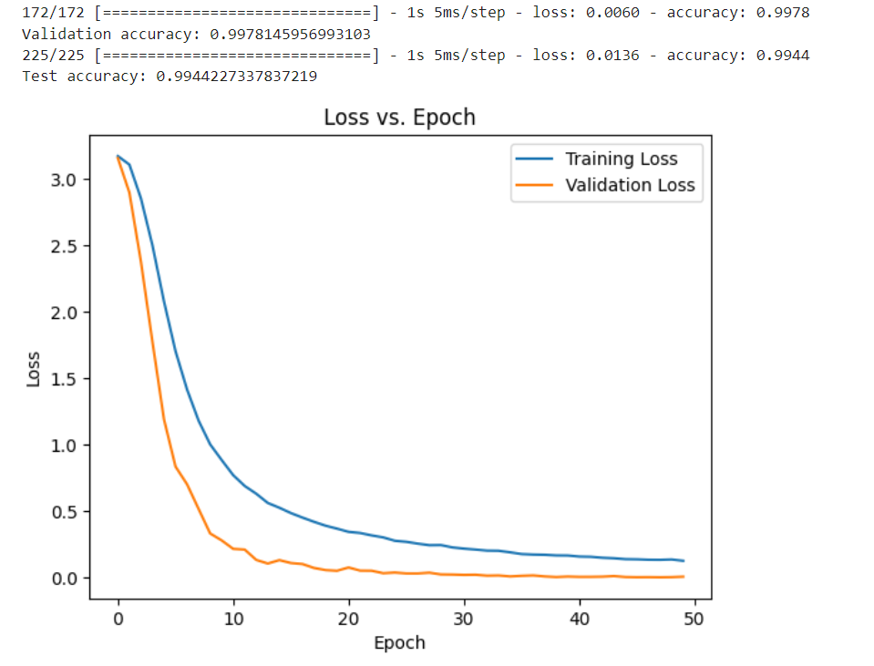
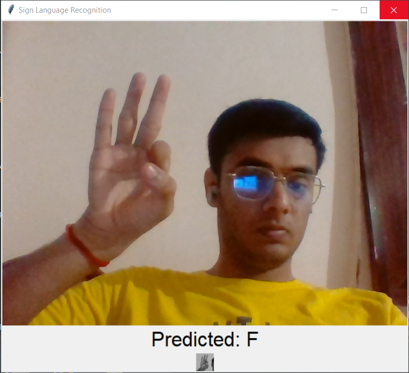
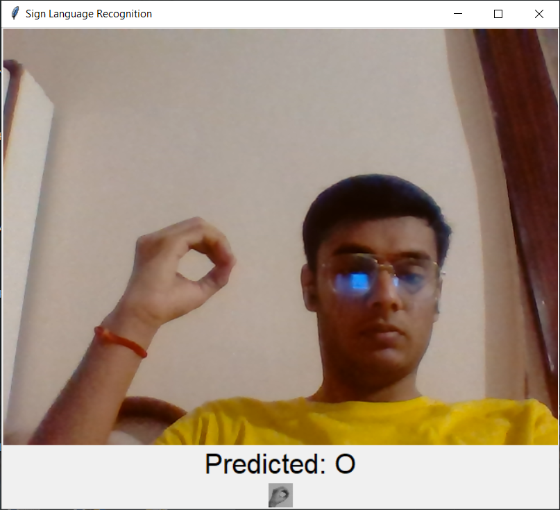

# Sign Language Detection

Real-time video capture using OpenCV and Real Time Sign Language Prediction.
CNN Model trained on MNIST Sign Language Dataset with 99% Validation Accuracy.

   
   
   

